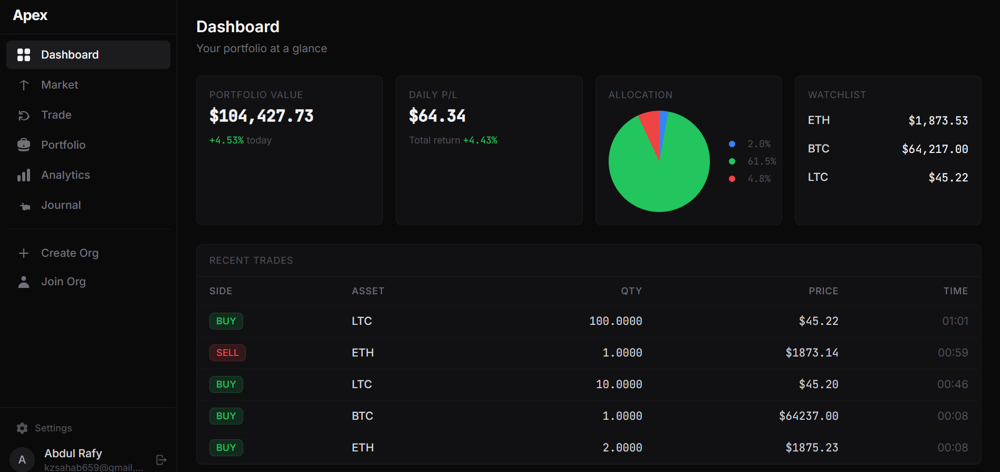
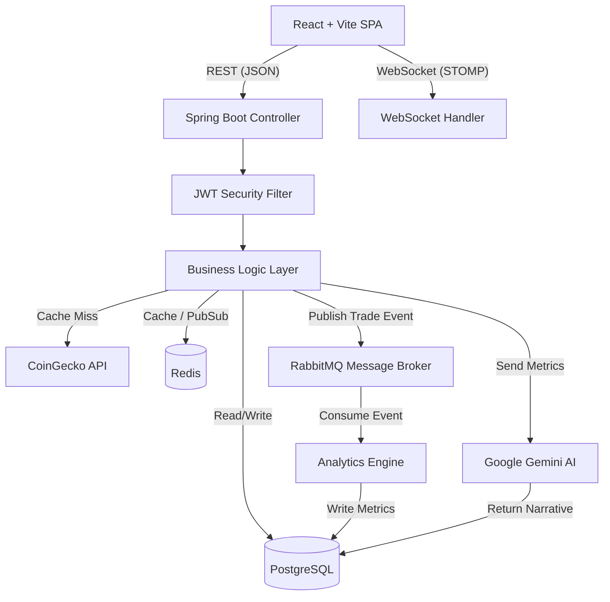

<div align="center">

  
  
  <h1>Apex Trading Intelligence</h1>
  
  <p><b>An Enterprise-Grade, Real-Time Market Simulation & Portfolio Intelligence Platform</b></p>

  <!-- Badges -->
  <p>
    <a href="https://openjdk.org/projects/jdk/21/"></a>
    <a href="https://spring.io/projects/spring-boot"></a>
    <a href="https://react.dev/"></a>
    <a href="https://www.typescriptlang.org/"></a>
    <a href="https://www.postgresql.org/"></a>
    <a href="https://redis.io/"></a>
    <a href="https://www.rabbitmq.com/"></a>
    <a href="https://www.docker.com/"></a>
  </p>

  <p>
    <em>Apex bridges the gap between novice trading applications and professional institutional platforms. <br/> It provides a highly realistic, zero-risk financial simulation environment packed with enterprise software patterns, AI-driven behavioral insights, and real-time data streaming.</em>
  </p>
  
  <p>
    <a href="#-why-apex-the-recruiters-tldr"><strong>Value Proposition</strong></a> · 
    <a href="#-technical-showcase"><strong>Technical Showcase</strong></a> · 
    <a href="#-system-architecture"><strong>Architecture</strong></a> · 
    <a href="#-getting-started"><strong>Quick Start</strong></a>
  </p>
</div>

---

## 💡 Why Apex? (The Recruiter's TL;DR)

Apex was engineered from the ground up to demonstrate proficiency in **modern full-stack enterprise development**, focusing on the rigorous demands of FinTech systems: **scalability, data integrity, low latency, and complex system integrations.** 

While many portfolio projects are simple CRUD apps, **Apex tackles real-world distributed system challenges**:

*   ⚡ **Event-Driven Microsecond Latency:** Uses **RabbitMQ** to decouple heavy analytics processing and notifications from the main trading thread, ensuring instantaneous order execution.
*   🛡️ **Enterprise Data Integrity & ACID Compliance:** Enforces **idempotent** API designs (preventing duplicate trades on network retries), optimistic locking for concurrent portfolio updates, and strict multi-tenant isolation at the query level.
*   🔥 **High-Performance Caching:** Leverages **Redis** to cache aggressive global market data polling (via CoinGecko), protecting external API rate limits and guaranteeing `<10ms` data retrieval.
*   📡 **Real-Time Data Streaming:** Utilizes **WebSockets (STOMP)** to push live price ticks, portfolio valuation updates, and executed trade notifications to connected React clients with zero polling overhead.
*   🧠 **Generative AI Integration:** Uses the **Google Gemini 1.5** LLM API to analyze a trader's mathematical daily performance metrics and generate personalized, behavioral trading psychology feedback.
*   🧪 **Production-Ready Testing:** Backed by over **230+ automated tests** (JUnit 5, Mockito, Testcontainers, React Testing Library) ensuring robust, refactor-safe code.

---

## 📸 Platform Interface

<p align="center">
  
</p>
<p align="center">
  <em>Dark-mode optimized, responsive dashboard powered by React 19, Tailwind CSS, and TradingView Lightweight Charts.</em>
</p>

---

<h2 id="-technical-showcase">🛠 Technology Stack & Justification</h2>

Every technology in Apex was chosen to solve a specific engineering problem:

| Layer | Technologies | Engineering Justification |
|-------|--------------|---------------------------|
| **Backend Core** | Java 21, Spring Boot 3.x, Spring Security (JWT) | Provides a robust, strictly typed, and secure foundation with built-in dependency injection and MVC architecture. |
| **Primary Database** | PostgreSQL 16, Spring Data JPA, Flyway | Ensures ACID compliance for financial transactions and strict relational data integrity. Flyway manages schema migrations. |
| **Caching Layer** | Redis 7 | Drastically reduces read latency for frequently accessed market data and user sessions. |
| **Message Broker** | RabbitMQ | Enables asynchronous, event-driven architecture, decoupling trade execution from heavy post-trade analytics. |
| **Real-Time Data** | WebSockets (STOMP/SockJS), CoinGecko REST | Pushes live market ticks to clients without the overhead of HTTP polling. |
| **AI / ML** | Google Gemini 1.5 Flash | Provides cutting-edge Generative AI capabilities for behavioral trading analysis. |
| **Frontend Core** | React 19, TypeScript, Vite, Tailwind CSS | Delivers a lightning-fast, type-safe Single Page Application (SPA) with a modern, responsive UI. |
| **State & API** | TanStack Query, Zustand | Manages complex server-state caching and global client-state seamlessly. |
| **DevOps** | Docker, Docker Compose, Nginx | Fully containerized environment ensures "it works on my machine" translates to "it works everywhere". |

---

## 🏗 System Architecture

Apex utilizes a modular, event-driven monolith design that is structurally prepared for future microservice extraction.



### Core Design Principles Implemented:
- **Layered Clean Architecture:** Strict separation of concerns (Controllers -> Services -> Repositories). No business logic leaks into the transport layer.
- **Idempotency:** Trade execution endpoints require an `Idempotency-Key` header. The ledger is append-only, ensuring financial data cannot be corrupted by network retries.
- **Multi-Tenancy:** First-class support for Organizations and Cohorts. Every database query is strictly scoped server-side using the authenticated principal's context.

---

## ✨ Standout Features

*   🌍 **Live Global Market Search:** Search the entire CoinGecko database live and instantly add any global asset (e.g., Solana, NVIDIA) to the PostgreSQL database for real-time tracking.
*   📊 **Advanced Portfolio Analytics:** Real-time calculation of professional metrics including Sharpe Ratio, Maximum Drawdown, Win Rate, and FIFO-matched Profit/Loss.
*   🤖 **AI Trading Journal:** Daily behavioral narratives generated by Google Gemini, summarizing the trader's psychological performance based on their mathematical metrics.
*   🔐 **Role-Based Access Control (RBAC):** Distinct permissions and granular access controls for Super Admins, Organization Admins, Instructors, and Traders.
*   📈 **Interactive Data Visualization:** Lightweight, high-performance financial charts (OHLCV) powered by TradingView's Lightweight Charts library.

---

## 🚀 Getting Started

Apex is fully containerized. You can spin up the entire enterprise stack locally with a single command, without worrying about dependency conflicts.

### Prerequisites
- [Docker](https://www.docker.com/) and Docker Compose
- Node.js 20+ (optional, for local frontend development)
- Java 21 (optional, for local backend development)

### One-Click Deployment

1. **Clone the repository:**
   ```bash
   git clone https://github.com/abdul-rafy2005/Apex.git
   cd Apex
   ```

2. **Configure Environment Variables:**
   ```bash
   cp .env.example .env
   # Open .env and add your Google Gemini API Key and a secure JWT Secret
   ```

3. **Launch the Infrastructure:**
   ```bash
   docker compose up -d --build
   ```
   *This single command builds the Java backend, compiles the React frontend, and spins up PostgreSQL, Redis, RabbitMQ, and Nginx reverse proxy.*

4. **Access the Platform:**
   - **Frontend UI:** `http://localhost:5173` (Or the port mapped by Docker)
   - **Backend API:** `http://localhost:8080/api/v1`
   - **Swagger/OpenAPI Documentation:** `http://localhost:8080/api/v1/swagger-ui.html`

---

## 🧪 Testing Strategy

Apex treats testing as a first-class citizen, demonstrating production-ready engineering standards.

- **Backend (131+ Tests):** Includes Mockito unit tests for isolated business logic, and Testcontainers for integration tests against real PostgreSQL and Redis instances. Validates concurrency (optimistic locking), idempotency, and cross-tenant security.
  ```bash
  cd Backend && ./mvnw verify
  ```
- **Frontend (100+ Tests):** Vitest and React Testing Library ensure component behavior and hook logic remain stable.
  ```bash
  cd frontend && npm test
  ```

---

<div align="center">
  <b>Built with precision. Designed for scale.</b><br><br>
  <a href="https://github.com/abdul-rafy2005">GitHub Profile</a> • <a href="mailto:your.email@example.com">Contact Developer</a>
</div>
