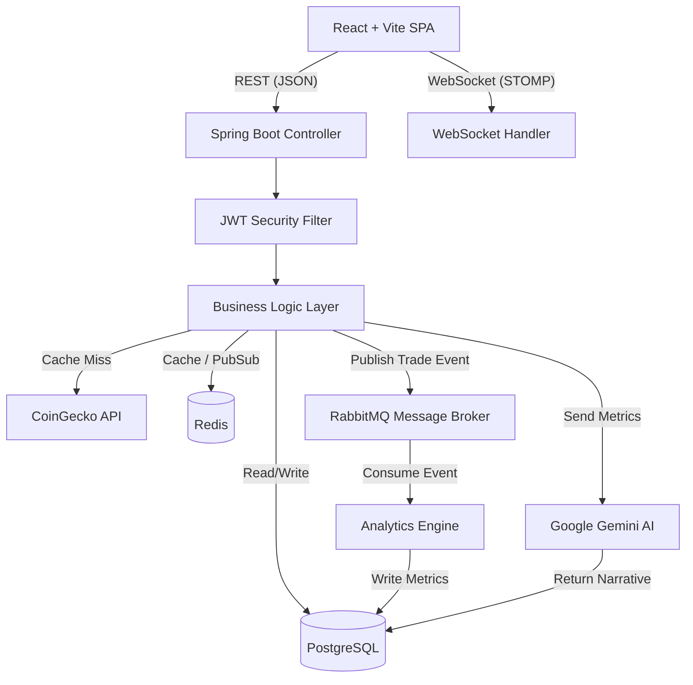

<div align="center">
  
  # Apex Trading Platform
  
  **An Enterprise-Grade, Real-Time Market Simulation & Portfolio Intelligence Platform**

  [](https://openjdk.org/projects/jdk/21/)
  [](https://spring.io/projects/spring-boot)
  [](https://react.dev/)
  [](https://www.typescriptlang.org/)
  [](https://www.postgresql.org/)
  [](https://redis.io/)
  [](https://www.rabbitmq.com/)
  [](https://www.docker.com/)

  *Apex bridges the gap between novice trading applications and professional institutional platforms. It provides a highly realistic, zero-risk financial simulation environment packed with enterprise software patterns, AI-driven behavioral insights, and real-time data streaming.*
  
  [Key Technical Achievements](#-why-apex-the-recruiters-tldr) · [Architecture](#-system-architecture) · [Getting Started](#-getting-started) · [API Documentation](#-api-documentation)
</div>

---

## 💡 Why Apex? (The Recruiter's TL;DR)

Apex was built to demonstrate proficiency in **modern full-stack enterprise development**, focusing heavily on scalability, data integrity, and complex system integrations. 

Instead of building a simple CRUD application, Apex tackles real-world distributed system challenges:
- **Event-Driven Asynchronous Processing:** Uses **RabbitMQ** to decouple heavy analytics processing and notifications from the main trading thread, ensuring microsecond order execution latency.
- **High-Performance Caching:** Leverages **Redis** to cache aggressive global market data polling (via CoinGecko), protecting external API rate limits and providing instant `<10ms` data retrieval to the frontend.
- **Real-Time WebSockets (STOMP):** Pushes live price ticks, portfolio valuation updates, and executed trade notifications to connected React clients in real-time.
- **Generative AI Integration:** Uses the **Google Gemini 1.5** LLM API to analyze a trader's daily performance metrics and generate personalized, behavioral trading psychology feedback.
- **Enterprise Data Integrity:** Enforces **idempotent** API designs (preventing duplicate trades on network retries), optimistic locking for concurrent portfolio updates, and strict multi-tenant isolation at the database query level.
- **Strictly Typed & Tested:** Backed by over 230+ automated tests (JUnit, Mockito, Testcontainers, React Testing Library) ensuring robust CI/CD pipelines.

---

## 🛠 Tech Stack

| Layer | Technologies |
|-------|--------------|
| **Backend Core** | Java 21, Spring Boot 3.x, Spring Security (JWT), Spring Data JPA, Flyway |
| **Data & Messaging** | PostgreSQL 16 (Relational), Redis 7 (Caching & Pub/Sub), RabbitMQ (Message Queue) |
| **Real-Time Data** | WebSockets (STOMP/SockJS), Scheduled Cron Jobs, CoinGecko REST API |
| **AI Integration** | Google Gemini 1.5 Flash (Generative Language API) |
| **Frontend Core** | React 19, TypeScript (Strict), Vite, Tailwind CSS, Headless UI |
| **State Management** | TanStack Query (Server State), Zustand (Client State) |
| **DevOps & Infra** | Docker, Docker Compose, Nginx, GitHub Actions |
| **Testing** | JUnit 5, Mockito, Testcontainers, Vitest, React Testing Library |

---

## 🏗 System Architecture

Apex utilizes a modular, event-driven monolith design that is prepared for future microservice extraction.



### Core Design Principles Implemented:
- **Layered Clean Architecture:** Strict separation of concerns (Controllers -> Services -> Repositories). No business logic leaks into the transport layer.
- **Idempotency:** Trade execution endpoints require an `Idempotency-Key` header. The ledger is append-only, ensuring financial data cannot be corrupted by network retries.
- **Multi-Tenancy:** First-class support for Organizations and Cohorts. Every database query is strictly scoped server-side using the authenticated principal's context.

---

## ✨ Standout Features

- **Live Global Market Search:** Search the entire CoinGecko database live and instantly add any global asset (e.g., Solana, Dogecoin) to the PostgreSQL database for real-time tracking.
- **Advanced Portfolio Analytics:** Real-time calculation of professional metrics including Sharpe Ratio, Maximum Drawdown, Win Rate, and FIFO-matched Profit/Loss.
- **AI Trading Journal:** Daily behavioral narratives generated by Google Gemini, summarizing the trader's psychological performance based on their mathematical metrics.
- **Role-Based Access Control (RBAC):** Distinct permissions for Super Admins, Organization Admins, Instructors, and Traders.
- **Interactive Data Visualization:** Lightweight, high-performance financial charts (OHLCV) powered by TradingView's Lightweight Charts library.

---

## 🚀 Getting Started

Apex is fully containerized. You can spin up the entire enterprise stack with a single command.

### Prerequisites
- Docker and Docker Compose
- Node.js 20+ (for local frontend development)
- Java 21 (for local backend development)

### One-Click Deployment

1. **Clone the repository:**
   ```bash
   git clone https://github.com/abdul-rafy2005/Apex.git
   cd Apex
   ```

2. **Configure Environment Variables:**
   ```bash
   cp .env.example .env
   # Add your Google Gemini API Key and a secure JWT Secret to the .env file
   ```

3. **Launch the Infrastructure:**
   ```bash
   docker compose up -d --build
   ```
   *This single command builds the Java backend, compiles the React frontend, and spins up PostgreSQL, Redis, RabbitMQ, and Nginx.*

4. **Access the Platform:**
   - Frontend UI: `http://localhost:5173` (Dev) or mapped Docker port
   - Backend API: `http://localhost:8080/api/v1`
   - Swagger Documentation: `http://localhost:8080/api/v1/swagger-ui.html`

---

## 🧪 Testing Strategy

Apex treats testing as a first-class citizen. 

- **Backend (131+ Tests):** Includes Mockito unit tests for isolated business logic, and Testcontainers for integration tests against real PostgreSQL and Redis instances. Validates concurrency (optimistic locking), idempotency, and cross-tenant security.
  ```bash
  cd Backend && ./mvnw verify
  ```
- **Frontend (100+ Tests):** Vitest and React Testing Library ensure component behavior and hook logic remain stable.
  ```bash
  cd frontend && npm test
  ```

---

<div align="center">
  <b>Built with precision. Designed for scale.</b>
</div>
