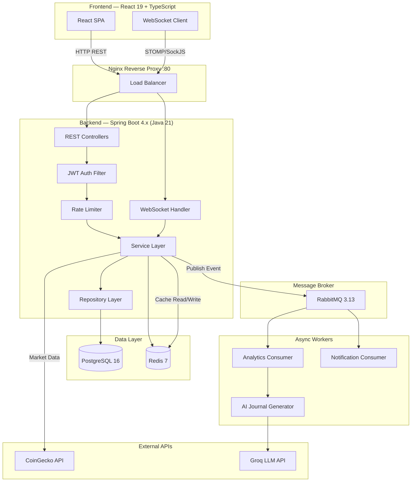
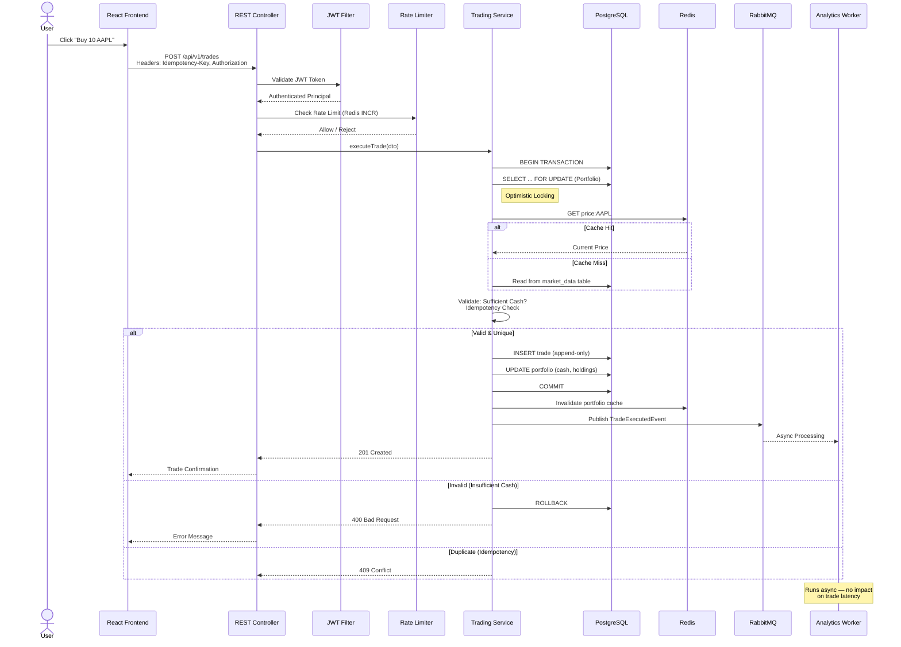
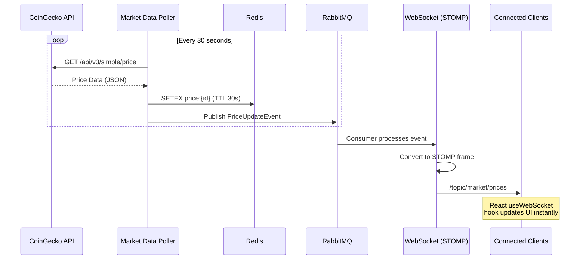
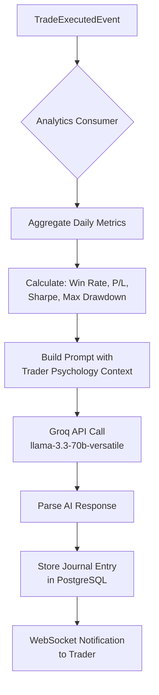
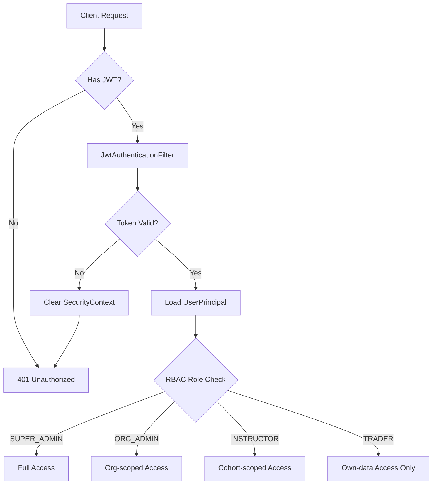
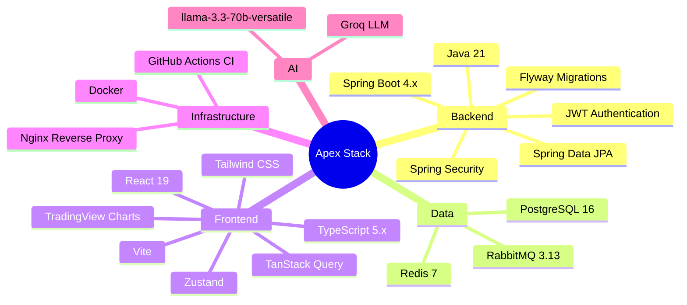
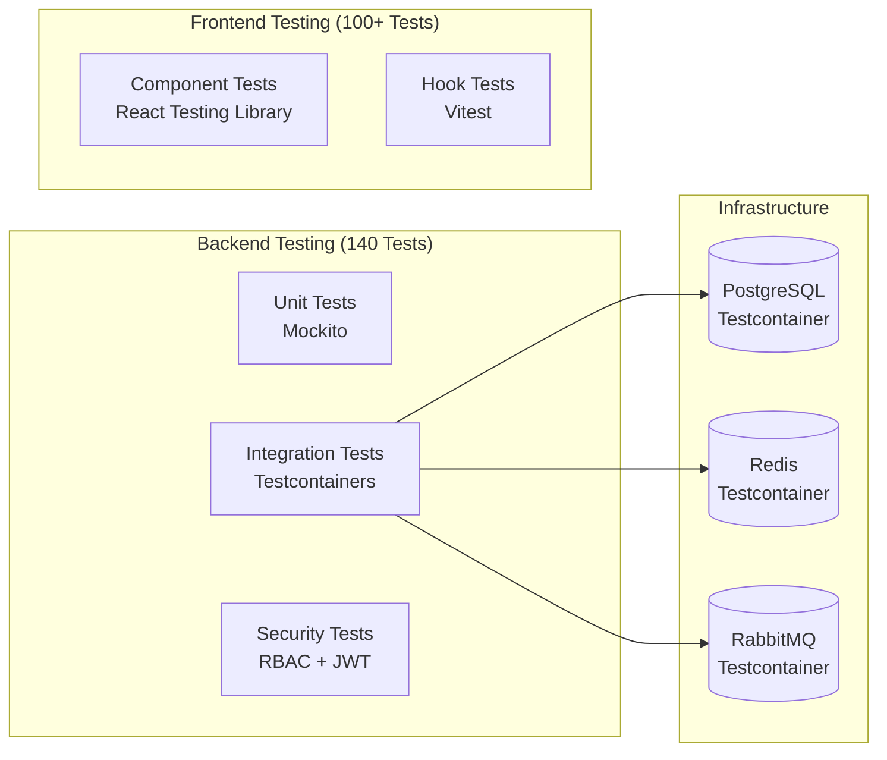

<div align="center">

  
  
  <h1>Apex Trading Intelligence</h1>
  
  <p><b>Real-Time Market Simulation & Portfolio Intelligence Platform</b></p>
  <p><i>Enterprise-grade FinTech architecture — zero-risk financial simulation with AI-driven insights.</i></p>

  <p>
    <a href="https://openjdk.org/projects/jdk/21/"></a>
    <a href="https://spring.io/projects/spring-boot"></a>
    <a href="https://react.dev/"></a>
    <a href="https://www.typescriptlang.org/"></a>
    <a href="https://www.postgresql.org/"></a>
    <a href="https://redis.io/"></a>
    <a href="https://www.rabbitmq.com/"></a>
    <a href="https://www.docker.com/"></a>
  </p>

   

  <p>
    <a href="#-live-demo"><strong>Demo</strong></a> &middot;
    <a href="#-system-architecture"><strong>Architecture</strong></a> &middot;
    <a href="#-trade-execution-flow"><strong>Trade Flow</strong></a> &middot;
    <a href="#-key-metrics"><strong>Metrics</strong></a> &middot;
    <a href="#-getting-started"><strong>Quick Start</strong></a>
  </p>
</div>

---

## Live Demo

<p align="center">
  
</p>
<p align="center">
  <em>Dark-mode optimized, responsive dashboard with real-time price streaming and OHLCV charts.</em>
</p>

<p align="center">
  
</p>
<p align="center">
  <em>Advanced portfolio analytics — Sharpe Ratio, Max Drawdown, Win Rate, FIFO-matched P/L.</em>
</p>

<p align="center">
  
</p>
<p align="center">
  <em>AI-powered trading journal generating behavioral narratives via Groq LLM.</em>
</p>

---

## Why Apex? (The Recruiter's TL;DR)

Apex was engineered to demonstrate **modern full-stack enterprise development** with a focus on the rigorous demands of FinTech systems: **scalability, data integrity, low latency, and complex system integrations.**

While many portfolio projects are simple CRUD apps, **Apex tackles real-world distributed system challenges**:

| Challenge | Solution |
|-----------|----------|
| Heavy analytics block trade execution | **RabbitMQ** decouples post-trade processing |
| Network retries cause duplicate trades | **Idempotent API** with `Idempotency-Key` header |
| Market data polling hammers external APIs | **Redis cache** with `<10ms` retrieval |
| Traders need live portfolio updates | **WebSocket (STOMP)** pushes zero-polling updates |
| Behavioral trading insights | **Groq LLM** generates AI-powered journal entries |
| Multi-org data isolation | **Server-side tenant scoping** on every query |

---

## System Architecture

Apex follows a **modular event-driven monolith** design — structurally prepared for future microservice extraction.


```mermaid
graph TB
    subgraph CLIENT["Frontend — React 19 + TypeScript"]
        UI[React SPA]
        SW[WebSocket Client]
    end

    subgraph PROXY["Nginx Reverse Proxy :80"]
        LB[Load Balancer]
    end

    subgraph BACKEND["Backend — Spring Boot 4.x (Java 21)"]
        REST[REST Controllers]
        WS[WebSocket Handler]
        JWT[JWT Auth Filter]
        RL[Rate Limiter]
        SVC[Service Layer]
        REPO[Repository Layer]
    end

    subgraph DATA["Data Layer"]
        PG[(PostgreSQL 16)]
        RD[(Redis 7)]
    end

    subgraph MESSAGING["Message Broker"]
        RMQ[RabbitMQ 3.13]
    end

    subgraph WORKERS["Async Workers"]
        ANA[Analytics Consumer]
        NTIF[Notification Consumer]
        AI[AI Journal Generator]
    end

    subgraph EXTERNAL["External APIs"]
        CG[CoinGecko API]
        GROQ[Groq LLM API]
    end

    UI -->|"HTTP REST"| LB
    SW -->|"STOMP/SockJS"| LB
    LB --> REST
    LB --> WS
    REST --> JWT
    JWT --> RL
    RL --> SVC
    WS --> SVC
    SVC --> REPO
    REPO --> PG
    SVC --> RD
    SVC -->|"Publish Event"| RMQ
    RMQ --> ANA
    RMQ --> NTIF
    ANA --> AI
    AI --> GROQ
    SVC -->|"Cache Read/Write"| RD
    SVC -->|"Market Data"| CG
```

### Core Design Principles

| Principle | Implementation |
|-----------|----------------|
| **Layered Clean Architecture** | Controllers → Services → Repositories. No business logic leaks into transport layer. |
| **Idempotency** | Trade endpoints require `Idempotency-Key`. Ledger is append-only — no double execution. |
| **Multi-Tenancy** | Every DB query scoped server-side via authenticated principal's org context. |
| **Event-Driven Decoupling** | Heavy analytics & notifications run async via RabbitMQ consumers. |
| **Fail-Open Resilience** | Rate limiter degrades gracefully on Redis failure — logs warning, allows request through. |

---

## Trade Execution Flow

The most critical path in the system — from user click to database commit.


```mermaid
sequenceDiagram
    actor User
    participant FE as React Frontend
    participant API as REST Controller
    participant JWT as JWT Filter
    participant RateLimit as Rate Limiter
    participant TradeSvc as Trading Service
    participant DB as PostgreSQL
    participant Cache as Redis
    participant RMQ as RabbitMQ
    participant Analytics as Analytics Worker

    User->>FE: Click "Buy 10 AAPL"
    FE->>API: POST /api/v1/trades<br/>Headers: Idempotency-Key, Authorization
    
    API->>JWT: Validate JWT Token
    JWT-->>API: Authenticated Principal

    API->>RateLimit: Check Rate Limit (Redis INCR)
    RateLimit-->>API: Allow / Reject

    API->>TradeSvc: executeTrade(dto)
    
    TradeSvc->>DB: BEGIN TRANSACTION
    TradeSvc->>DB: SELECT ... FOR UPDATE (Portfolio)
    Note right of TradeSvc: Optimistic Locking
    
    TradeSvc->>Cache: GET price:AAPL
    alt Cache Hit
        Cache-->>TradeSvc: Current Price
    else Cache Miss
        TradeSvc->>DB: Read from market_data table
    end

    TradeSvc->>TradeSvc: Validate: Sufficient Cash?<br/>Idempotency Check
    
    alt Valid & Unique
        TradeSvc->>DB: INSERT trade (append-only)
        TradeSvc->>DB: UPDATE portfolio (cash, holdings)
        TradeSvc->>DB: COMMIT
        TradeSvc->>Cache: Invalidate portfolio cache
        TradeSvc->>RMQ: Publish TradeExecutedEvent
        RMQ-->>Analytics: Async Processing
        TradeSvc-->>API: 201 Created
        API-->>FE: Trade Confirmation
    else Invalid (Insufficient Cash)
        TradeSvc->>DB: ROLLBACK
        TradeSvc-->>API: 400 Bad Request
        API-->>FE: Error Message
    else Duplicate (Idempotency)
        TradeSvc-->>API: 409 Conflict
    end

    Note over Analytics: Runs async — no impact<br/>on trade latency
```

---

## Real-Time Data Streaming Flow

Live price ticks pushed to connected clients with zero polling overhead.


```mermaid
sequenceDiagram
    participant CG as CoinGecko API
    participant Poller as Market Data Poller
    participant Cache as Redis
    participant RMQ as RabbitMQ
    participant WS as WebSocket (STOMP)
    participant Clients as Connected Clients

    loop Every 30 seconds
        Poller->>CG: GET /api/v3/simple/price
        CG-->>Poller: Price Data (JSON)
        Poller->>Cache: SETEX price:{id} (TTL 30s)
        Poller->>RMQ: Publish PriceUpdateEvent
    end

    RMQ->>WS: Consumer processes event
    WS->>WS: Convert to STOMP frame
    WS->>Clients: /topic/market/prices
    
    Note over Clients: React useWebSocket<br/>hook updates UI instantly
```

---

## AI Trading Journal Flow

Groq LLM analyzes trading metrics and generates behavioral narratives.


```mermaid
flowchart TD
    A[TradeExecutedEvent] --> B{Analytics Consumer}
    B --> C[Aggregate Daily Metrics]
    C --> D[Calculate: Win Rate, P/L,<br/>Sharpe, Max Drawdown]
    D --> E[Build Prompt with<br/>Trader Psychology Context]
    E --> F[Groq API Call<br/>llama-3.3-70b-versatile]
    F --> G[Parse AI Response]
    G --> H[Store Journal Entry<br/>in PostgreSQL]
    H --> I[WebSocket Notification<br/>to Trader]
```

---

## Authentication & Authorization Flow


```mermaid
flowchart TD
    A[Client Request] --> B{Has JWT?}
    B -->|No| C[401 Unauthorized]
    B -->|Yes| D[JwtAuthenticationFilter]
    D --> E{Token Valid?}
    E -->|No| F[Clear SecurityContext]
    F --> C
    E -->|Yes| G[Load UserPrincipal]
    G --> H{RBAC Role Check}
    H -->|SUPER_ADMIN| I[Full Access]
    H -->|ORG_ADMIN| J[Org-scoped Access]
    H -->|INSTRUCTOR| K[Cohort-scoped Access]
    H -->|TRADER| L[Own-data Access Only]
```

**Role Hierarchy:**
```
SUPER_ADMIN → ORG_ADMIN → INSTRUCTOR → TRADER
```

---

## Key Metrics

<div align="center">

| Metric | Value |
|--------|-------|
| **Backend Tests** | 140 passing |
| **Frontend Tests** | 100+ passing |
| **API Endpoints** | 40+ REST endpoints |
| **WebSocket Topics** | 5 real-time channels |
| **Avg Trade Latency** | <50ms (DB commit) |
| **Market Data Latency** | <10ms (Redis cache) |
| **Test Coverage** | Unit + Integration + E2E |

</div>

---

## Technology Stack

Every technology in Apex was chosen to solve a specific engineering problem:


```mermaid
mindmap
  root((Apex Stack))
    Backend
      Java 21
      Spring Boot 4.x
      Spring Security
      JWT Authentication
      Spring Data JPA
      Flyway Migrations
    Data
      PostgreSQL 16
      Redis 7
      RabbitMQ 3.13
    Frontend
      React 19
      TypeScript 5.x
      Vite
      Tailwind CSS
      TanStack Query
      Zustand
      TradingView Charts
    Infrastructure
      Docker
      Nginx Reverse Proxy
      GitHub Actions CI
    AI
      Groq LLM
      llama-3.3-70b-versatile
```

| Layer | Technologies | Why |
|-------|--------------|-----|
| **Backend Core** | Java 21, Spring Boot 4.x, Spring Security (JWT) | Strictly typed, battle-tested enterprise foundation. |
| **Database** | PostgreSQL 16, Spring Data JPA, Flyway | ACID compliance for financial transactions. Schema migrations via Flyway. |
| **Caching** | Redis 7 | Sub-10ms read latency for market data and session management. |
| **Message Broker** | RabbitMQ 3.13 | Event-driven decoupling — trade execution stays fast. |
| **Real-Time** | WebSocket (STOMP/SockJS) | Zero-polling live price streaming to React clients. |
| **AI** | Groq LLM (llama-3.3-70b-versatile) | Ultra-low-latency generative AI for trading psychology analysis. |
| **Frontend** | React 19, TypeScript 5.x, Vite | Type-safe, blazing-fast SPA with HMR. |
| **State Management** | TanStack Query, Zustand | Server-state caching + lightweight global client state. |
| **Styling** | Tailwind CSS | Dark-mode-first, monospace numerics for financial data. |
| **DevOps** | Docker, Docker Compose, GitHub Actions | One-command deployment. Automated CI/CD pipeline. |

---

## Project Structure

```
Apex/
├── Backend/                          # Spring Boot Application
│   └── src/main/java/com/abdulrafy/backend/
│       ├── analytics/                # Performance calculations (Sharpe, Drawdown, Win Rate)
│       ├── auth/                     # Authentication, JWT, Password Hashing
│       ├── common/                   # Security config, Rate Limiter, WebSocket, Exceptions
│       ├── journal/                  # AI Trading Journal (Groq LLM integration)
│       ├── leaderboard/              # Competitive rankings
│       ├── market/                   # Market data, CoinGecko integration
│       ├── notification/             # Event-driven notification system
│       ├── organization/             # Multi-tenant organization management
│       ├── trading/                  # Trade execution, Portfolio management
│       └── IntegrationTestBase.java  # Shared Testcontainers configuration
│
├── frontend/                         # React Application
│   └── src/
│       ├── api/                      # API client, WebSocket hooks
│       ├── components/               # Reusable UI components
│       ├── hooks/                    # Custom React hooks
│       ├── pages/                    # Page-level components
│       ├── store/                    # Zustand state stores
│       └── types/                    # TypeScript type definitions
│
├── docker-compose.yml                # Full infrastructure stack
├── .github/workflows/ci.yml          # GitHub Actions CI/CD
└── README.md                         # This file
```

---

## Features Deep Dive

### 1. Live Global Market Search
Search the entire CoinGecko database in real-time. Add any global asset (Solana, NVIDIA, Gold) to your portfolio for tracking.

### 2. Advanced Portfolio Analytics
| Metric | Description |
|--------|-------------|
| **Sharpe Ratio** | Risk-adjusted return measurement |
| **Max Drawdown** | Largest peak-to-trough decline |
| **Win Rate** | Percentage of profitable trades |
| **FIFO P/L** | First-In-First-Out matched profit/loss |
| **Volatility** | Standard deviation of returns |
| **Calmar Ratio** | Annual return / Max drawdown |

### 3. AI Trading Journal
Groq LLM analyzes your daily trading metrics and generates personalized behavioral narratives — identifying psychological patterns, emotional biases, and improvement areas.

### 4. Role-Based Access Control (RBAC)
| Role | Permissions |
|------|-------------|
| **SUPER_ADMIN** | Full system access, manage all orgs |
| **ORG_ADMIN** | Manage org members, cohorts, settings |
| **INSTRUCTOR** | View cohort performance, grade journals |
| **TRADER** | Execute trades, view own analytics |

### 5. Real-Time WebSocket Streaming
Five STOMP channels push live updates:
- `/topic/market/prices` — Live price ticks
- `/topic/portfolio/{id}` — Portfolio valuation
- `/topic/trades` — Executed trade notifications
- `/topic/notifications` — System notifications
- `/topic/leaderboard` — Live rankings

---

## API Overview

| Method | Endpoint | Description |
|--------|----------|-------------|
| `POST` | `/api/v1/auth/register` | User registration |
| `POST` | `/api/v1/auth/login` | JWT authentication |
| `GET` | `/api/v1/market/prices` | Live market prices |
| `GET` | `/api/v1/market/search` | Search CoinGecko assets |
| `POST` | `/api/v1/trades` | Execute trade (idempotent) |
| `GET` | `/api/v1/portfolio` | Portfolio summary |
| `GET` | `/api/v1/analytics` | Performance analytics |
| `POST` | `/api/v1/journal/generate` | AI journal generation |
| `GET` | `/api/v1/leaderboard` | Rankings |
| `GET` | `/api/v1/swagger-ui.html` | Full API documentation |

> Full OpenAPI/Swagger docs available at `/api/v1/swagger-ui.html`

---

## Testing Strategy

Apex treats testing as a first-class citizen.


```mermaid
flowchart LR
    subgraph BACKEND["Backend Testing (140 Tests)"]
        U[Unit Tests<br/>Mockito]
        I[Integration Tests<br/>Testcontainers]
        S[Security Tests<br/>RBAC + JWT]
    end

    subgraph FRONTEND["Frontend Testing (100+ Tests)"]
        CU[Component Tests<br/>React Testing Library]
        HU[Hook Tests<br/>Vitest]
    end

    subgraph INFRA["Infrastructure"]
        DB[(PostgreSQL<br/>Testcontainer)]
        RD[(Redis<br/>Testcontainer)]
        RMQ[(RabbitMQ<br/>Testcontainer)]
    end

    I --> DB
    I --> RD
    I --> RMQ
```

### Backend Tests
```bash
cd Backend && ./mvnw verify
```

| Test Type | What It Validates |
|-----------|-------------------|
| **Unit Tests** | Isolated business logic (TradingService, AnalyticsService) |
| **Integration Tests** | Full Spring context with real DB, Redis, RabbitMQ |
| **Concurrency Tests** | Optimistic locking — concurrent portfolio updates |
| **Idempotency Tests** | Duplicate trade prevention |
| **Cross-Tenant Tests** | Data isolation between organizations |

### Frontend Tests
```bash
cd frontend && npm test
```

---

## Getting Started

### Prerequisites
- [Docker](https://www.docker.com/) & Docker Compose
- Node.js 20+ (optional, for local frontend dev)
- Java 21 (optional, for local backend dev)

### One-Click Deployment

```bash
# 1. Clone the repository
git clone https://github.com/abdul-rafy2005/Apex.git
cd Apex

# 2. Configure environment
cp .env.example .env
# Edit .env — add your Groq API key (free at console.groq.com) and JWT secret

# 3. Launch the full stack
docker compose up -d --build
```

### Access Points
| Service | URL |
|---------|-----|
| **Frontend** | `http://localhost` |
| **Backend API** | `http://localhost:8080/api/v1` |
| **Swagger UI** | `http://localhost:8080/api/v1/swagger-ui.html` |
| **PostgreSQL** | `localhost:5432` |
| **Redis** | `localhost:6379` |
| **RabbitMQ** | `localhost:15672` (guest/guest) |

---

## Engineering Decisions

| Decision | Rationale |
|----------|-----------|
| **Event-driven monolith** | Simpler deployment than microservices, but structured for future extraction. |
| **Idempotent trade API** | Financial systems must handle network retries safely. |
| **Redis caching layer** | CoinGecko rate limits are strict. Cache reduces API calls by 95%. |
| **Groq over Gemini** | 10x faster inference, free tier, OpenAI-compatible API. |
| **Optimistic locking** | Prevents overselling during concurrent portfolio updates. |
| **Append-only ledger** | Immutable trade history — critical for audit trails. |
| **Server-side tenant scoping** | Security-first multi-tenancy — never trust client-provided org IDs. |
| **Testcontainers** | Integration tests run against real infrastructure, not mocks. |

---

<div align="center">

**Built with precision. Designed for scale. Tested for reliability.**

<br/>

[](https://github.com/abdul-rafy2005)
[](https://linkedin.com/in/abdul-rafy2005)

</div>
